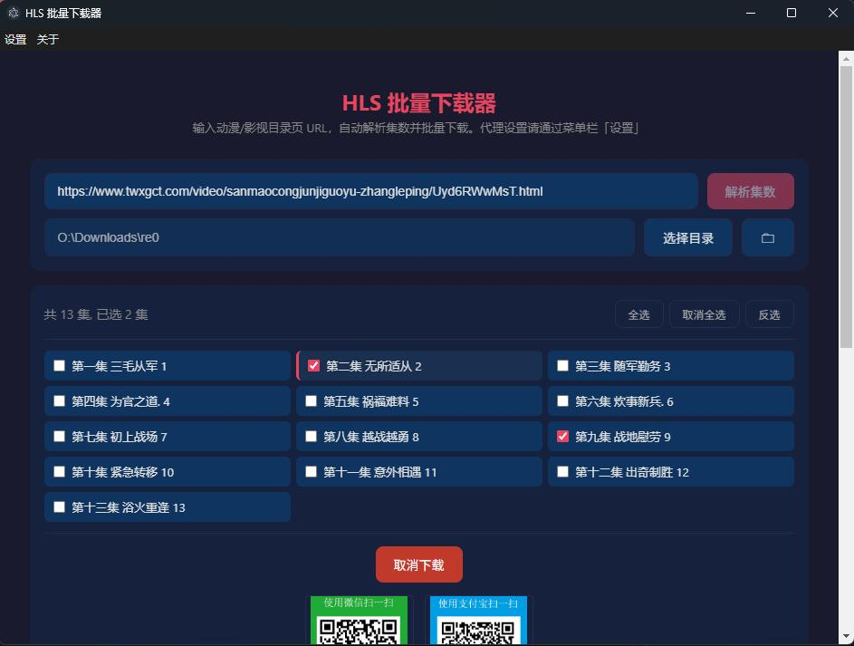
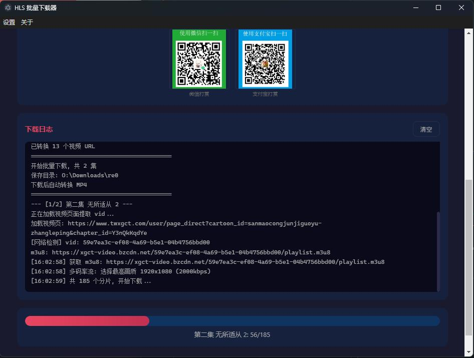

# HLS 批量下载器

基于 Electron 的 HLS 视频批量下载桌面应用。

## 功能

- 输入动漫/影视目录页 URL，自动解析全部集数
- 勾选/全选/反选需要下载的集数
- 逐集自动提取视频流，下载 HLS 分片并合并为 TS 文件
- 支持 HTTP / SOCKS5 代理（菜单栏「设置 → 代理设置」）
- 可选自动转 MP4（需系统安装 ffmpeg）
- 下载进度实时显示





## 使用

```bash
npm install
npm start
```

或双击 `start.vbs`（Windows 无控制台窗口启动）。

1. 输入目录页 URL（详见下方支持站点）
2. 点击「解析集数」
3. 勾选要下载的集，选择保存目录
4. 点击「开始下载」

## 支持站点

| 站点 | URL 示例 |
|------|----------|
| 西瓜卡通 | `https://www.xgcartoon.com/detail/xxx` |
| 西瓜卡通(视频页) | `https://www.twxgct.com/video/xxx/xxx.html` |
| 爱壹帆 | `https://www.yfsp.tv/play/xxx`（需手动通过 Cloudflare 验证） |

## 代理设置

菜单栏「设置 → 代理设置」支持 HTTP 和 SOCKS5 代理，可填写认证信息。

## 项目结构

```
├── main.js              # Electron 主进程
├── preload.js           # IPC 桥接
├── downloader/
│   ├── parsers.js       # 各站点评析器（扩展新站点在此添加）
│   ├── parser.js        # 页面加载 + vid 提取
│   └── hls-engine.js    # m3u8 下载 + 分片合并 + ffmpeg 转码
├── renderer/
│   ├── index.html       # UI
│   ├── style.css
│   └── renderer.js
└── imgs/                # 打赏二维码
```

## 添加新站点

编辑 `downloader/parsers.js`，新增一个解析器对象：

```js
{
  name: '站点名',
  match: (url) => /域名/.test(url),
  parseEpisodeList(html, url) { /* HTML 解析, 或 return null 用 JS 提取 */ },
  jsExtract() { return `function() { ... return eps; }`; },
  transformUrl(ep, catalogUrl) { /* 转换 episode URL */ }
}
```
